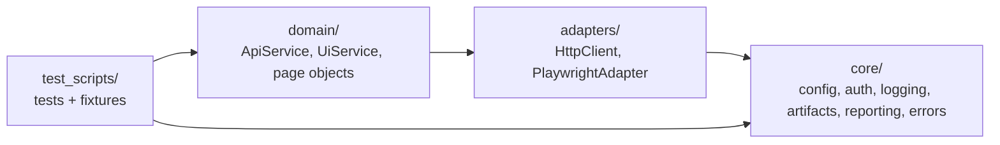

# New Hybrid API/UI Test Framework

A reference architecture for API and UI test automation: layered modules, parallel-safe execution, CI quality gates and run reports. The [test strategy](docs/TEST_STRATEGY.md) and [architecture decision records](docs/adr/) explain the reasoning.

## Architecture



- Tests talk to `domain` services and page objects, never to httpx or Playwright directly.
- `adapters` wrap the third-party clients; `core` has no dependency on the layers above it.
- `tests/unit/` covers `core` and `adapters` without network or env file.

## Setup

### Dev container (recommended)

Open the repository in VS Code and choose **Reopen in Container**, or open it in GitHub Codespaces. [.devcontainer/](.devcontainer/) installs Python 3.13, Poetry, all dependencies, Chromium, Firefox and WebKit, the pre-commit hooks, and creates `.env.dev` from `.env.example`. Browser downloads are cached in a named volume, and port 9323 is forwarded for the Playwright trace viewer (`poe show-trace <zip>`).

### Local

Requires Python 3.11+ and Poetry 2.x.

```sh
poetry install
poetry run poe setup          # Playwright Chromium + git pre-commit hooks
cp .env.example .env.dev      # public demo targets; edit for your environment
```

## Configuration

Settings are loaded by [core/config/settings.py](core/config/settings.py).

- Env file: `--env-file <path>`, else the `ENV_FILE` variable, else `.env.dev` if it exists.
- Non-empty process environment variables override env-file values. CI relies on this (see below).
- See [.env.example](.env.example) for all keys. OAuth clients are declared as `OAUTH_CLIENT_NAME_<X>`, `OAUTH_CLIENT_ID_<X>`, `OAUTH_CLIENT_SECRET_<X>`, `OAUTH_SCOPE_<X>`.
- `PLAYWRIGHT_BROWSER` selects `chromium` (default), `firefox` or `webkit`.

## What is tested

| Type | Example | Marker |
|---|---|---|
| Contract | API responses parsed into strict pydantic models ([domain/api/models.py](domain/api/models.py)) | `contract` |
| Negative / security | Missing, malformed, wrong-scheme and tampered tokens; invalid client secret and scope | `security` |
| UI with mocked network | Mocked data, injected items, HTTP 500/503, added latency (`page.route`) | `network` |
| Accessibility | axe-core scan; new serious/critical violations fail, known ones are [baselined](test_scripts/data/a11y_baseline.json) | `a11y` |
| Hybrid | Data from the protected API rendered by the UI | `hybrid` |
| Cross-browser | Any UI test on Chromium, Firefox or WebKit | `PLAYWRIGHT_BROWSER` |
| Framework | Unit, property-based (Hypothesis) and mutation tests (mutmut) on `core/` | `tests/unit/` |

Every e2e test declares `@pytest.mark.scenario("ID")` from [requirements.json](test_scripts/data/requirements.json). Collection fails for missing or unknown ids, and `poe traceability` also fails when a requirement has no test.

## Running tests

Run tasks with `poetry run poe <task>`; extra arguments are passed to pytest.

| Task | Runs |
|---|---|
| `test-unit` | Framework unit and property tests with coverage (fails under 90%) |
| `test-smoke` | `-m smoke` |
| `test-regression` | `-m regression`, parallel |
| `test-api` / `test-ui` | `-m api` / `-m ui` |
| `test-e2e` | everything in `test_scripts/` |
| `check` | ruff lint, format check, mypy, traceability |
| `mutation` | mutmut on `core/`, fails under 80% |
| `audit` | pip-audit for known vulnerabilities |
| `lint-workflows` | zizmor on `.github/` |
| `install-all-browsers` | Chromium, Firefox and WebKit |

Markers: `api`, `ui`, `hybrid`, `contract`, `security`, `network`, `a11y`, `smoke`, `regression`, `scenario(id)`, `quarantine(reason)`. Unknown markers fail the run.

Examples:

```sh
poetry run poe test-api --env-file .env.stage -k identity
PLAYWRIGHT_BROWSER=webkit poetry run poe test-ui -n auto
poetry run pytest "test_scripts/ui/test_todo_app.py::test_todo_app_opens"
```

## Reports and artifacts

| Output | How |
|---|---|
| JUnit XML | `--junitxml=reports/junit.xml` |
| HTML report | `--html=reports/report.html --self-contained-html`; UI failures embed a screenshot |
| GitHub job summary | Written automatically when `GITHUB_STEP_SUMMARY` is set: counts, duration, failed tests, flaky tests, traceability matrix |
| Traceability matrix | `--traceability-report <file>`: requirement, tests, PASSED / FAILED / SKIPPED / NOT RUN |
| Run history | GitHub Pages: last 50 e2e s only. To add an environment, create it in GitHub and add its name to the `environment` input options.

The run history is pushed to the `gh-pages` branch (created on the first run). Enable Pages once under Settings > Pages > Deploy from branch `gh-pages`
| Logs | `.artifacts/<run>/<worker>.log`, including HTTP request/response lines |
| UI failure artifacts | `.artifacts/<run>/<test id>/`: screenshot and Playwright trace (`poe show-trace <zip>`) |

In `e2e.yml`, reports and logs are uploaded on every run. When a run fails, traces are uploaded as a separate `playwright-traces-<browser>-<run>` artifact, and the job summary links to it.

## Flaky tests

e2e runs rerun failed tests (default 2); tests that pass only on a rerun are listed as flaky in the job summary. A test that stays flaky gets `@pytest.mark.quarantine(reason="<issue link> <cause>")`: it then runs in a separate non-blocking step. The reason is mandatory. See [ADR 0006](docs/adr/0006-flaky-test-policy.md).

## CI

| Workflow | Trigger | Does |
|---|---|---|
| [ci.yml](.github/workflows/ci.yml) | pull request, push to `main` | `lint` (ruff, mypy, traceability), `workflows` (actionlint, zizmor), `unit` (Python 3.11 and 3.13, coverage), `mutation` (score gate), `security` (pip-audit, dependency review) |
| [codeql.yml](.github/workflows/codeql.yml) | pull request, push to `main` | CodeQL for Python and GitHub Actions |
| [e2e.yml](.github/workflows/e2e.yml) | manual dispatch (nightly schedule present but commented out) | Runs a suite (`regression`, `smoke`, `api`, `ui`, `all`, or a `custom` marker expression) against a path or single node id, on one browser or all three; quarantined tests in a non-blocking step; publishes the run history to GitHub Pages |
| [devcontainer.yml](.github/workflows/devcontainer.yml) | PRs touching `.devcontainer/` or dependencies | Builds the dev container and runs `poe check` and `poe test-unit` inside it |
| [dependabot.yml](.github/dependabot.yml) | monthly, 7-day cooldown | Python dependencies (minor/patch grouped), GitHub Actions, dev container features |

Actions are pinned to version tags and kept current by Dependabot. Pre-commit runs ruff, gitleaks and zizmor. To make the CI jobs quality gates, mark them as required status checks in the `main` branch protection rule.

### GitHub environment for e2e.yml

Create an environment (Settings > Environments, e.g. `dev`) and add:

| Variables | Secrets |
|---|---|
| `ENV_NAME`, `API_BASE_URL`, `UI_BASE_URL`, `OAUTH_TOKEN_URL` | `OAUTH_CLIENT_SECRET_A` |
| `OAUTH_CLIENT_NAME_A`, `OAUTH_CLIENT_ID_A`, `OAUTH_SCOPE_A` | `OAUTH_CLIENT_SECRET_B` |
| `OAUTH_CLIENT_NAME_B`, `OAUTH_CLIENT_ID_B`, `OAUTH_SCOPE_B` | |
| Optional: `TOKEN_CACHE_PATH`, `LOG_CONSOLE_LEVEL`, `LOG_FILE_LEVEL`, `TIMEZONE`, `HTTP_TIMEOUT_SECONDS`, `PLAYWRIGHT_LAUNCH_ARGS` | |

The workflow passes these to the test step only. To add an environment, create it in GitHub and add its name to the `environment` input options.

## Project layout

```
core/           config, auth (OAuth + shared token cache), logging, artifacts, reporting (summary, traceability), errors, utils
adapters/       HttpClient (httpx), PlaywrightAdapter (network control, axe scan)
domain/         ApiService + contract models, UiService, ui/pages/ page objects
test_scripts/   e2e tests (api/, ui/, hybrid/), fixtures (conftest.py), test data and requirements catalog
tests/unit/     framework unit and property-based tests
tools/          CI helpers: mutation score, report history
docs/           test strategy and ADRs
```

## Contributing

- **Issues:** open one with a template: [bug report](.github/ISSUE_TEMPLATE/bug_report.yml), [flaky test](.github/ISSUE_TEMPLATE/flaky_test.yml) or [feature request](.github/ISSUE_TEMPLATE/feature_request.yml).
- **Pull requests:** fill in the [PR template](.github/pull_request_template.md). All CI checks must pass.
- **Conduct:** everyone taking part follows the [Code of Conduct](CODE_OF_CONDUCT.md).

## License

This project is licensed under the GNU General Public License v3.0. See `LICENSE` for details.
