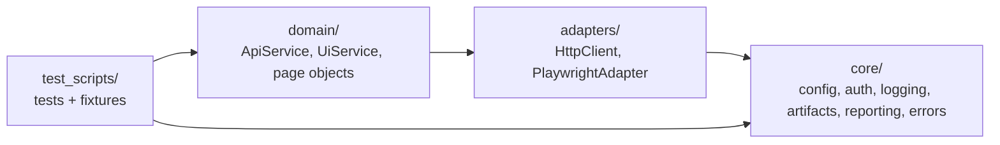

# New Hybrid API/UI Test Framework

A reference architecture for API and UI test automation: layered modules, parallel-safe execution, CI quality gates and run reports.

## Architecture



- Tests talk to `domain` services and page objects, never to httpx or Playwright directly.
- `adapters` wrap the third-party clients; `core` has no dependency on the layers above it.
- `tests/unit/` covers `core` and `adapters` without network or env file.

## Setup

Requires Python 3.11+ and Poetry 2.x.

```sh
poetry install
poetry run poe setup          # Playwright Chromium + git pre-commit hooks
cp .env.example .env.dev      # public demo targets; edit for your environment
```

## Configuration

Settings are loaded by [core/config/settings.py](core/config/settings.py).

- Env file: `--env-file <path>`, else the `ENV_FILE` variable, else `.env.dev` if it exists.
- Non-empty process environment variables override env-file values. CI relies on this (see below).
- See [.env.example](.env.example) for all keys. OAuth clients are declared as `OAUTH_CLIENT_NAME_<X>`, `OAUTH_CLIENT_ID_<X>`, `OAUTH_CLIENT_SECRET_<X>`, `OAUTH_SCOPE_<X>`.

## Running tests

Run tasks with `poetry run poe <task>`; extra arguments are passed to pytest.

| Task | Runs |
|---|---|
| `test-unit` | Framework unit tests with coverage (fails under 90%) |
| `test-smoke` | `-m smoke` |
| `test-regression` | `-m regression`, parallel |
| `test-api` / `test-ui` | `-m api` / `-m ui` |
| `test-e2e` | everything in `test_scripts/` |
| `check` | ruff lint, ruff format check, mypy |

Markers: `api`, `ui`, `smoke`, `regression` (unknown markers fail the run).

Examples:

```sh
poetry run poe test-api --env-file .env.stage -k identity
poetry run poe test-e2e -n auto
poetry run pytest "test_scripts/ui/test_todo_app.py::test_todo_app_opens"
```

## Reports and artifacts

| Output | How |
|---|---|
| JUnit XML | `--junitxml=reports/junit.xml` |
| HTML report | `--html=reports/report.html --self-contained-html`; UI failures embed a screenshot |
| GitHub job summary | Written automatically when `GITHUB_STEP_SUMMARY` is set: counts, duration, failed tests |
| Logs | `.artifacts/<run>/<worker>.log`, including HTTP request/response lines |
| UI failure artifacts | `.artifacts/<run>/<test id>/`: screenshot and Playwright trace (`playwright show-trace <zip>`) |

In `e2e.yml`, reports and logs are uploaded on every run. When a run fails, traces are uploaded as a separate `playwright-traces-<run>` artifact, and the job summary links to it.

## CI

| Workflow | Trigger | Does |
|---|---|---|
| [ci.yml](.github/workflows/ci.yml) | pull request, push to `main` | `lint` job (`poe check`) and `unit` job on Python 3.11 and 3.13 with coverage in the job summary |
| [e2e.yml](.github/workflows/e2e.yml) | manual dispatch (nightly schedule present but commented out) | Runs a suite (`regression`, `smoke`, `api`, `ui`, `all`, or a `custom` marker expression) against a path or single node id |
| [dependabot.yml](.github/dependabot.yml) | monthly | Python dependencies (minor/patch grouped) and GitHub Actions |

To make `lint` and `unit` quality gates, mark them as required status checks in the `main` branch protection rule.

### GitHub environment for e2e.yml

Create an environment (Settings > Environments, e.g. `dev`) and add:

| Variables | Secrets |
|---|---|
| `ENV_NAME`, `API_BASE_URL`, `UI_BASE_URL`, `OAUTH_TOKEN_URL` | `OAUTH_CLIENT_SECRET_A` |
| `OAUTH_CLIENT_NAME_A`, `OAUTH_CLIENT_ID_A`, `OAUTH_SCOPE_A` | `OAUTH_CLIENT_SECRET_B` |
| `OAUTH_CLIENT_NAME_B`, `OAUTH_CLIENT_ID_B`, `OAUTH_SCOPE_B` | |
| Optional: `TOKEN_CACHE_PATH`, `LOG_CONSOLE_LEVEL`, `LOG_FILE_LEVEL`, `TIMEZONE`, `HTTP_TIMEOUT_SECONDS`, `PLAYWRIGHT_LAUNCH_ARGS` | |

The workflow passes these to the test step only. To add an environment, create it in GitHub and add its name to the `environment` input options.

## Project layout

```
core/           config, auth (OAuth + shared token cache), logging, artifacts, reporting, errors, utils
adapters/       HttpClient (httpx), PlaywrightAdapter
domain/         ApiService, UiService, ui/pages/ page objects
test_scripts/   e2e tests, fixtures (conftest.py), test data
tests/unit/     framework unit tests
```

## Contributing

- **Issues:** open one with a template: [bug report](.github/ISSUE_TEMPLATE/bug_report.yml), [flaky test](.github/ISSUE_TEMPLATE/flaky_test.yml) or [feature request](.github/ISSUE_TEMPLATE/feature_request.yml).
- **Pull requests:** fill in the [PR template](.github/pull_request_template.md). The `lint` and `unit` checks must pass.
- **Conduct:** everyone taking part follows the [Code of Conduct](CODE_OF_CONDUCT.md).

## License

This project is licensed under the GNU General Public License v3.0. See `LICENSE` for details.
