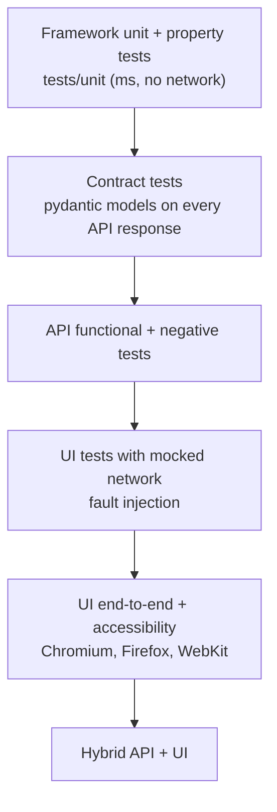

# Test Strategy

This document says what we test, at which level, how results gate changes, and why. Architecture decisions behind it are recorded in [adr/](adr/).

## 1. Objectives

| Objective | Measured by |
|---|---|
| Catch regressions in the system under test before release | Regression suite on demand, per environment and browser |
| Keep the framework itself trustworthy | Unit, property-based and mutation tests on `core/` |
| Make every result traceable to a requirement | `scenario` marker, catalog check, traceability matrix |
| Make failures cheap to diagnose | Logs, screenshots, Playwright traces, HTML report, job summary |
| Keep the pipeline itself safe | Workflow linting, version-pinned actions, dependency audit, CodeQL, secret scanning |

## 2. Test levels

| Level | Location | Purpose | Runs in |
|---|---|---|---|
| Framework unit | `tests/unit/` | Config parsing, token cache locking, reporting, tooling | Every PR |
| Property-based | `tests/unit/test_properties.py` | Invariants for parsers and renderers over generated input (Hypothesis) | Every PR |
| Mutation | `core/` via mutmut | Proves the unit tests detect changes, not just execute lines | Every PR |
| Contract | `test_scripts/api/test_contracts.py` | Response shape and required fields; also enforced implicitly by `ApiService` parsing | e2e |
| API functional | `test_scripts/api/` | Tokens per client, caching, protected endpoint behaviour | e2e |
| API negative / security | `test_scripts/api/test_auth_negative.py` | Missing, malformed, wrong-scheme, tampered tokens; invalid client and scope | e2e |
| UI with mocked network | `test_scripts/ui/test_network_resilience.py` | Deterministic data, injected items, 5xx and latency handling | e2e |
| UI end-to-end | `test_scripts/ui/test_todo_app.py` | User journeys through page objects | e2e |
| Accessibility | `test_scripts/ui/test_accessibility.py` | axe-core scan; new serious/critical violations fail, known ones are baselined | e2e |
| Hybrid | `test_scripts/hybrid/` | Data from the API rendered correctly by the UI | e2e |

Out of scope today: load/performance testing and visual (pixel) regression. Both need a stable, owned environment; the demo targets are public third-party sites.

## 3. Suites and selection

Layer markers (`api`, `ui`, `hybrid`) describe *what* a test touches; type markers (`contract`, `security`, `network`, `a11y`) describe *why* it exists; suite markers (`smoke`, `regression`) decide *when* it runs. Markers are strict: unknown markers fail the run.

| Suite | Content | Trigger |
|---|---|---|
| `smoke` | One fast check per critical capability | After every deploy |
| `regression` | All e2e tests | Before release, or on demand |
| `custom` | Any marker expression, path or node id | Investigation |

## 4. Requirements traceability

Every e2e test carries `@pytest.mark.scenario("ID")`. IDs live in [`test_scripts/data/requirements.json`](../test_scripts/data/requirements.json). Collection fails when a test has no scenario, when an ID is unknown, or (in CI) when a requirement has no test. Each run reports a requirement-level matrix (PASSED / FAILED / SKIPPED / NOT RUN) in the job summary, and scenario IDs are written to JUnit XML properties for import into a test management tool.

## 5. Quality gates

| Gate | Where | Blocks merge |
|---|---|---|
| Ruff lint and format, mypy strict | `ci.yml` / lint | Yes |
| Traceability check | `ci.yml` / lint | Yes |
| actionlint, zizmor | `ci.yml` / workflows | Yes |
| Unit + property tests, coverage ≥ 90% (Python 3.11 and 3.13) | `ci.yml` / unit | Yes |
| Mutation score ≥ 80% on `core/` | `ci.yml` / mutation | Yes |
| pip-audit, dependency review (high+) | `ci.yml` / security | Yes |
| CodeQL (Python, Actions) | `codeql.yml` | Yes, when required in branch protection |
| gitleaks, ruff, zizmor | pre-commit | Locally |
| E2E suites | `e2e.yml`, on demand | Release decision |

## 6. Flaky tests

- Failed tests are rerun (default 2). A test that passes only on rerun is **reported as flaky** in the job summary, not hidden.
- A flaky test gets a [Flaky test issue](../.github/ISSUE_TEMPLATE/flaky_test.yml). If it cannot be fixed quickly it is marked `@pytest.mark.quarantine(reason="<issue link> <cause>")`.
- Quarantined tests run in a separate, non-blocking step. A reason is mandatory; collection fails without it.
- Leaving quarantine requires the fix plus several consecutive green runs.

## 7. Test data and environments

- Test data is static JSON in `test_scripts/data/`; UI tests that need state seed it through storage or mocks rather than through other tests.
- Tests are independent and parallel-safe (pytest-xdist). Shared OAuth tokens are cached across workers under a file lock.
- Environment settings come from an env file locally and from GitHub environment variables and secrets in CI. Secrets never appear in code, logs or test data.

## 8. Reporting

| Audience | Artifact |
|---|---|
| PR author | Job summary: counts, failures, flaky tests, coverage, mutation score |
| QA engineer | HTML report, worker logs, screenshots, Playwright traces |
| Lead / release | Traceability matrix, run history with pass-rate trend on GitHub Pages |
| Tools | JUnit XML with scenario properties |

## 9. Definition of done for a new test

- Goes through `domain` services or page objects; no direct httpx or Playwright calls.
- Has a layer marker, a suite marker and a `scenario` linked to the catalog.
- Is independent, parallel-safe and passes on all three browsers if it is a UI test.
- Fails for the right reason: run it once against a broken expectation before merging.
